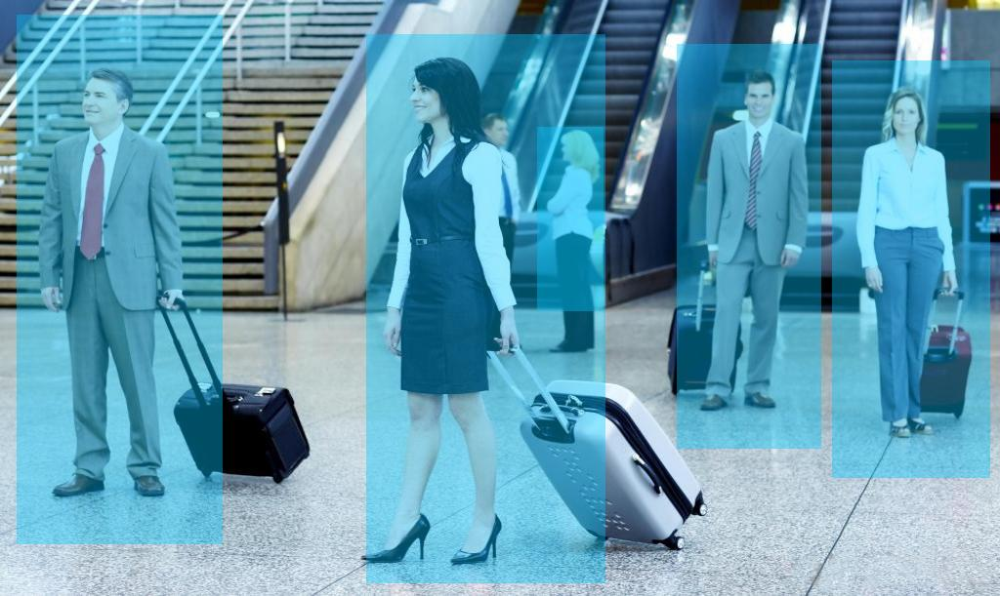

# Real Time Detection and Tracking System on UAV

# Problem Statement Summary
Build a real time car/people detection and tracking system on DJI drones. The solution should include:

The videos should be captured by cameras on Drones. 

Software framework should be based on ROS.

Car/people should be detected by deep learning methods and indicated by bounding box.

Positions and orientation control should be updated in real time (10 Hz or faster)

# Required Data Set

[COCO](http://cocodataset.org/#download)( Pedestrian )

Data set(coco) has been obtained by Microsoft. COCO is a large-scale object detection, segmentation, and captioning dataset.

[KITTI](http://www.cvlibs.net/datasets/kitti/eval_object.php)( Car )

Left color images of object data set 12GB 

Training labels of object data set 5MB 

Object development kit  1MB

# Approach
Combine DJI M100, DJI X3 cameras, DJI Manifold, NVIDIA TX1 , ROS to generate result.

## TX1:
Use KITTI dataset to training a new detectnet caffe model.(NVIDIA TX1 and [Digits](https://github.com/NVIDIA/DIGITS/blob/master/docs/GettingStarted.md))  Solver type = Adam  Learning rate = 0.0001  Batch size = 2  Batch Accumulation = 5 Epoch = 30 pretrained model = Google Net

[detectNet.cpp](tx1/src/jetson/detectNet.cpp)

Use TensorRT to accelerate the caffe model. (NVIDIA deep vision runtime library)

[detectNet.h](tx1/src/jetson/detectNet.h)

Use Cuda kernal to process each image and its bounding box(Cuda C/C++ API)

[detectnet-console.cpp](tx1/src/jetson/detectnet-console/detectnet-console.cpp)

This net will return the coordinates of objects bounding boxes.(NVIDIA deep vision runtime library )

Use ROS to send message between camera, manifold, TX1. (ROS image_transport sensor_msg cv_bridge std_msgs)

## TK1(DJI Manifold)
Use DJI X3 camera for 4k video capture and use ROS to send image.(Onboard-SDK-ROS 3.1 DJI_SDK_read_cam)
[nv_cam.cpp](tk1/rosdji_sdk/src/Onboard-SDK-ROS-3.1/dji_sdk_read_cam/src/nv_cam.cpp)

Use DJI manifold to process KCF algorithm for tracking return bounding box of tracked pedstrain/car (University of Coimbra C++ Implementation of KCF Tracker + ROS )
[runtracker.cpp](tk1/rosdji_sdk/src/Onboard-SDK-ROS-3.1/kcf_detect/src/runtracker.cpp)

Calibrate cameras to acquire essentical matrix
[uavcontrol.cpp](tk1/rosdji_sdk/src/Onboard-SDK-ROS-3.1/uavcontrol/src/uavcontrol.cpp)

Transfer 2D coordinates to 3D coordinates by essentianl matrix and foundamental matrix for drone control.
[uavcontrol.cpp](tk1/rosdji_sdk/src/Onboard-SDK-ROS-3.1/uavcontrol/src/uavcontrol.cpp)

Use DJI flying control SDK and implement a kalman filter to control DJI M100. (DJI Onboard-SDK-ROS 3.6 demo_flight_control)
[uavcontrol.cpp](tk1/rosdji_sdk/src/Onboard-SDK-ROS-3.1/uavcontrol/src/uavcontrol.cpp)

# Result
## image test

## video test

## Drone test

